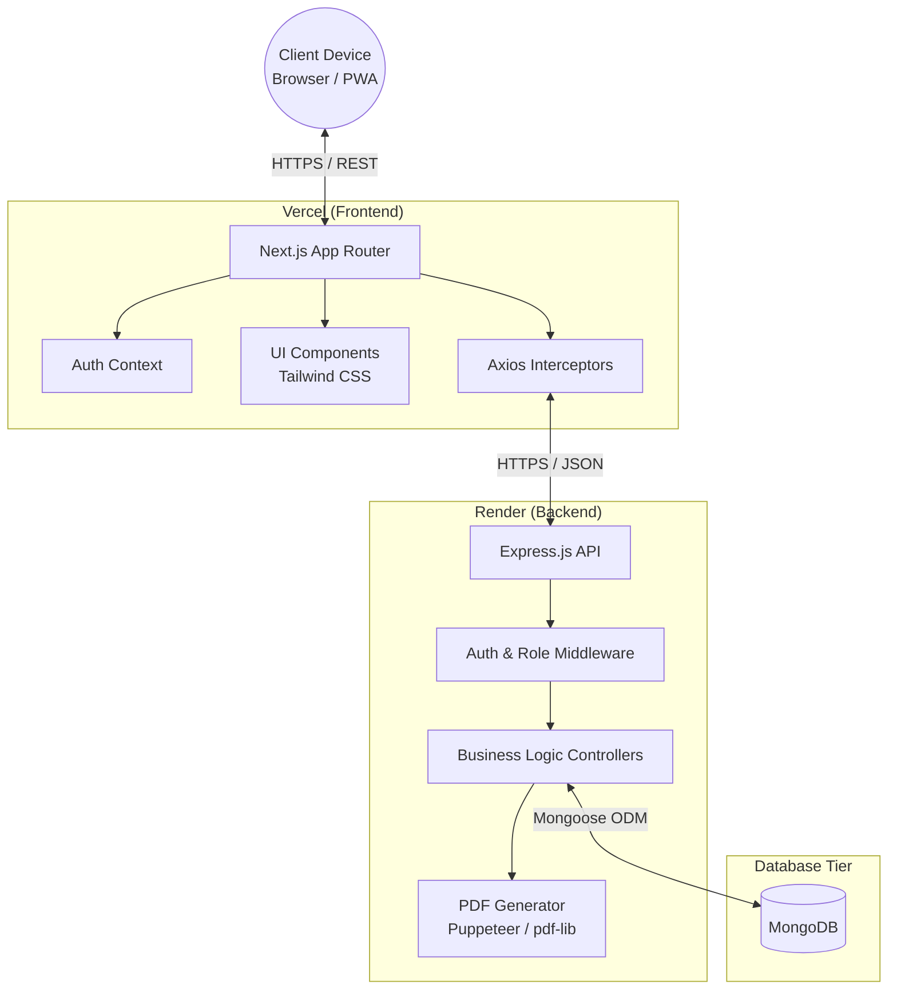

# Pathology Lab Management System - Architecture Diagram

This diagram illustrates the high-level decoupled client-server architecture of the application, showing how the Next.js frontend communicates with the Node.js/Express backend and MongoDB.

