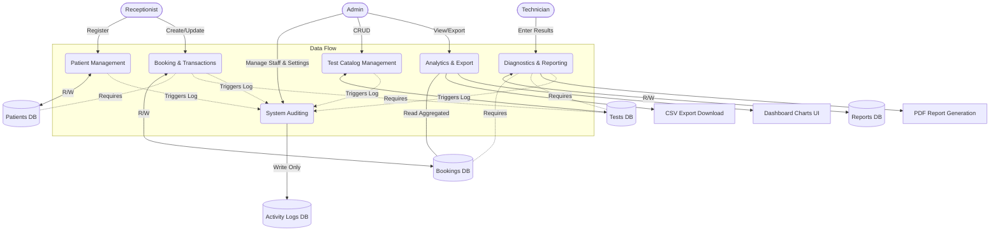

# Data Flow Diagram (DFD)

This diagram illustrates how information flows through the Pathology Lab Management System. It highlights how various actors (Admin, Receptionist, Technician) interact with the core entities (Patients, Bookings, Reports, Activity Logs).

## Description of Data Flows

1. **Patient Data:** Registered by the Receptionist. Stored in the `Patients DB`. Used by the Booking Process.
2. **Test Catalog Data:** Maintained by the Admin. Stored in the `Tests DB`. Used during booking creation and report generation to validate ranges and prices.
3. **Booking Data:** Generated when a patient pays for tests. Links `Patient` and `Tests` together. Updates lifecycle statuses (`pending`, `sample_collected`).
4. **Report Data:** Entered by Technicians against specific Bookings. Once completed, the system generates a downloadable PDF file merging patient info, lab settings, and result values.
5. **Auditing Flow:** Every mutating action (Create, Update, Delete) across the system automatically dispatches a payload to the `Activity Logs DB` to preserve a historical audit trail.
6. **Analytics Flow:** The Admin dashboard aggregates raw transactional data from the `Bookings DB` and processes it into visual charts or CSV exports for accounting purposes.
