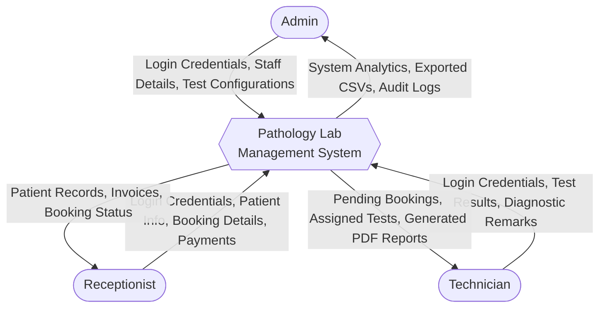
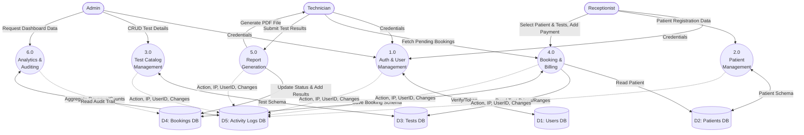

# Data Flow Diagram (DFD)

This document provides a detailed breakdown of how data moves through the Pathology Lab Management System. It includes both a high-level Context Diagram (Level 0) and a more detailed Process Diagram (Level 1), along with the exact data payloads transferred between entities.

---

## 1. Level 0: Context Diagram

The Context Diagram shows the system as a single high-level process interacting with external entities (Actors).

---

## 2. Level 1: Detailed Process Data Flow

This diagram breaks down the main system into specific sub-processes and shows how they interact with the internal databases (MongoDB Collections).

---

## 3. Data Payloads (What data is moving?)

To better understand the diagrams above, here is a breakdown of the exact data fields transferred during key processes:

### A. Patient Registration Flow
*   **Input (Receptionist -> System):** `name`, `age`, `gender`, `phone`, `email` (optional), `address`.
*   **Storage (System -> Patient DB):** Generates a unique `patientId` (e.g., `PT-0001`), adds `createdAt` and `updatedAt` timestamps.

### B. Test Catalog Flow
*   **Input (Admin -> System):** `testName`, `testCode`, `price`, `normalRange` (e.g., "70-110 mg/dL"), `isActive`.
*   **Storage (System -> Test DB):** Saves the test parameters used for billing and diagnostic validation.

### C. Booking & Payment Flow
*   **Input (Receptionist -> System):** `patientId`, array of `testIds`, `referredBy`, `totalAmount`, `paymentStatus` (paid/unpaid).
*   **Storage (System -> Booking DB):** Generates a unique `bookingId` (e.g., `BK-0001`). Sets initial status to `pending`. Embeds the current test prices to prevent historical invoice changes if a test price is updated later.

### D. Result Entry & Reporting Flow
*   **Input (Technician -> System):** `bookingId`, Array of results: `[{ testId, resultValue }]`, `remarks`.
*   **Process:** System checks `resultValue` against `normalRange` (from Tests DB). Status is updated from `pending` -> `completed`.
*   **Output (System -> User):** System merges Patient Info + Test Results into an HTML template and uses `puppeteer` to convert it into a downloadable PDF binary.

### E. Analytics & Auditing Flow
*   **Analytics (DB -> System -> Admin):** Uses MongoDB `$group` and `$sum` to calculate: Total Revenue, Total Bookings, Bookings by Status (pending vs completed), and Weekly Trends.
*   **Audit Logging (Any Process -> Log DB):** Captures `userId` (who did it), `action` (e.g., `CREATE_BOOKING`, `UPDATE_PATIENT`), `details` (what changed), `ipAddress`, and `timestamp`.
