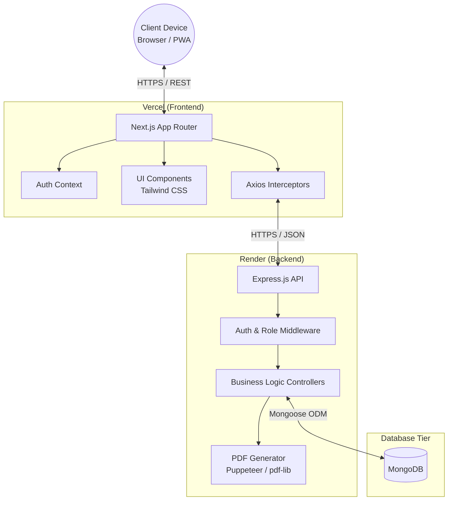
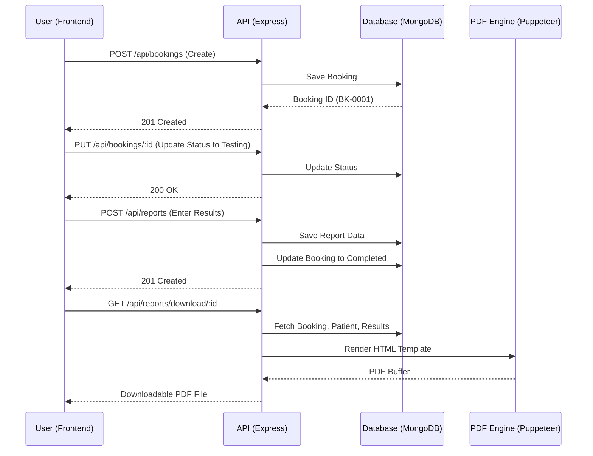

<div align="center">
  
</div>

# Pathology Lab Management System

A comprehensive, full-stack, and PWA-enabled pathology laboratory management platform designed to digitize patient records, streamline test bookings, track sample lifecycles, and generate professional diagnostic reports.

<div align="center">


</div>

---

## Table of Contents

- [Project Overview](#project-overview)
  - [Problem Statement](#problem-statement)
  - [Solution](#solution)
- [Live Demo](#live-demo)
- [Tech Stack](#tech-stack)
- [System Architecture](#system-architecture)
  - [Architecture Diagram](#architecture-diagram)
  - [Architecture Components Table](#architecture-components-table)
- [Project Structure](#project-structure)
- [Features](#features)
- [Application Workflow](#application-workflow)
- [API Documentation](#api-documentation)
- [Database Design](#database-design)
  - [Data Models](#data-models)
- [Authentication & Authorization](#authentication--authorization)
- [Security Considerations](#security-considerations)
- [Environment Variables](#environment-variables)
- [Installation & Setup](#installation--setup)
- [Deployment Guide](#deployment-guide)
- [UI / UX & Responsive Design](#ui--ux--responsive-design)
- [Performance & Error Handling](#performance--error-handling)
- [Code Quality & Testing](#code-quality--testing)
- [Current Limitations](#current-limitations)
- [Future Improvements](#future-improvements)
- [Architecture Decisions](#architecture-decisions)
- [Production Readiness](#production-readiness)
- [Troubleshooting](#troubleshooting)
- [Contributing](#contributing)
- [License](#license)
- [Project Metadata](#project-metadata)

---

## Project Overview

The Pathology Lab Management System is a modern web application tailored for diagnostic centers, hospitals, and independent pathology labs. It offers an end-to-end workflow starting from patient registration, test cataloging, and sample collection, to result entry and automated PDF report generation.

### Problem Statement

**The Challenge:**
Many small to medium-scale pathology laboratories still rely on manual ledger books or disconnected Excel sheets to manage patient data, book tests, and track samples. This manual workflow leads to:
- High probability of human error in transcribing patient details and test results.
- Difficulty in tracking the real-time status of a sample (e.g., Pending, Collected, Testing, Completed).
- Inefficient billing and payment tracking (Partial payments, Unpaid dues).
- Tedious report generation using MS Word templates which is time-consuming and inconsistent.
- No secure, role-based access control (receptionists having the same access as technicians or admins).

### Solution

**The Software Intervention:**
This project digitalizes the entire pathology workflow. It solves the aforementioned pain points by providing:
- **Centralized Database:** All patient history and test bookings are stored securely in a MongoDB database.
- **Role-Based Access Control (RBAC):** Admins can manage settings/users, receptionists can book tests and collect payments, and technicians can enter test results.
- **Automated Lifecycle Tracking:** Bookings move through structured statuses (`pending` -> `sample_collected` -> `testing` -> `completed`).
- **Automated PDF Generation:** Once a technician enters the results, the system instantly generates a professional PDF report with the lab's logo and headers/footers.
- **PWA Experience:** Staff can install the dashboard on their tablets or mobile devices as a Progressive Web App (PWA) for faster, native-like access.

---

## Live Demo

### Frontend
Vercel:
[Live Frontend](https://pathology-lab-xl.vercel.app)

### Backend / API
Render:
[Live Backend API](https://pathology-lab-r16i.onrender.com)

---

## Tech Stack

### Frontend
- **Framework:** Next.js 14.2.3 (App Router) - Provides server-side rendering capabilities, fast routing, and SEO optimization.
- **Language:** JavaScript (ES6+) - Standard language for web logic.
- **Styling:** Tailwind CSS - Utility-first CSS framework for rapid UI development and responsive design.
- **Icons:** Lucide React - Clean, modern iconography.
- **State Management:** React Context API (`AuthContext`, `ToastProvider`) - Manages global authentication state and UI notifications.
- **PWA:** `@ducanh2912/next-pwa` - Implements service workers and manifest generation for offline capabilities and app installation.
- **HTTP Client:** Axios - Handles API requests to the backend with interceptors for token injection.

### Backend
- **Runtime:** Node.js - Fast, asynchronous runtime for the API.
- **Framework:** Express.js - Minimalist web framework for routing and middleware management.
- **Authentication:** JSON Web Tokens (JWT) & bcryptjs - Secure password hashing and stateless session management.
- **Report Generation:** `pdf-lib` and `puppeteer` - Dynamically generates and manipulates PDF files for patient reports.
- **Middleware:** CORS, Express JSON parser.

### Database
- **Database:** MongoDB
- **ODM:** Mongoose - Provides schema validation, relationship mapping, and pre-save hooks (e.g., auto-generating IDs).

### Deployment
- **Frontend Hosting:** Vercel
- **Backend Hosting:** Render
- **Version Control:** Git & GitHub

---

## System Architecture

The application follows a decoupled client-server architecture. The frontend is a Next.js application that communicates over HTTP/REST with an Express.js backend, which in turn reads/writes to a MongoDB database.

### Architecture Diagram



### Architecture Components Table

| Layer | Component | Technology | Responsibility |
|-------|-----------|------------|----------------|
| Client | UI / PWA | Next.js, Tailwind | Renders the dashboard, forms, and handles user interactions. |
| Client State | Global Context | React Context | Manages JWT tokens, user roles, and global toast notifications. |
| API Gateway | REST Endpoints | Express.js | Exposes structured routes for frontend consumption. |
| Security | Auth Middleware | JWT, bcryptjs | Validates tokens, checks user roles (admin, tech, receptionist). |
| Business Logic | Controllers | Node.js | Handles CRUD operations, status updates, and business rules. |
| PDF Engine | Report Generator | Puppeteer, pdf-lib| Converts test results and HTML templates into printable PDF reports. |
| Database | Data Store | MongoDB | Persistent storage for users, patients, tests, bookings, and reports. |

---

## Project Structure

```text
Blood Lab/
├── backend/
│   ├── config/
│   │   └── db.js                 # MongoDB connection logic
│   ├── controllers/              # Business logic (auth, bookings, patients, reports)
│   ├── middleware/               # Auth and role-verification middleware
│   ├── models/                   # Mongoose schemas (User, Patient, Test, Booking, Report)
│   ├── routes/                   # Express route definitions
│   ├── utils/
│   │   └── pdfGenerator.js       # Puppeteer PDF generation logic
│   ├── server.js                 # Express app entry point
│   └── package.json
├── frontend/
│   ├── public/
│   │   ├── icons/                # PWA icons
│   │   └── manifest.json         # PWA manifest
│   ├── src/
│   │   ├── app/                  # Next.js App Router pages (login, dashboard, settings)
│   │   ├── components/           # Reusable UI components (Modals, Nav, InstallPrompt)
│   │   ├── context/              # AuthContext for state management
│   │   └── lib/
│   │       └── api.js            # Axios configuration
│   ├── next.config.mjs           # Next.js & PWA configuration
│   ├── tailwind.config.js
│   └── package.json
├── render.yaml                   # Render deployment configuration
└── README.md
```

### Important Folders Explained
- **`backend/models/`**: Contains the exact data structures and validation rules for MongoDB. Includes pre-save hooks for generating custom IDs (e.g., `PAT-0001`, `BK-0002`).
- **`frontend/src/app/`**: Utilizes the modern Next.js App Router. Each folder represents a route (e.g., `/dashboard/patients`).
- **`frontend/src/components/`**: Houses modals (like `NewBookingModal`), navigation bars, and the aggressive `InstallPrompt` for the PWA.

---

## Features

### User & Role Management
- Secure Login with JWT.
- Role-based views: Admin, Receptionist, Technician.
- Account activation/deactivation.

### Patient Management
- Register new patients with demographics.
- Auto-generation of unique Patient IDs (`PAT-XXXX`).
- View patient history and past bookings.

### Test Catalog
- Add, edit, and categorize diagnostic tests.
- Define test prices, normal ranges, and measurement units.
- Toggle active/inactive status for tests.

### Booking & Billing
- Create bookings mapping patients to multiple tests.
- Auto-generation of Booking IDs (`BK-XXXX`).
- Track payment status (`paid`, `unpaid`, `partial`).
- Track booking lifecycle (`pending`, `sample_collected`, `testing`, `completed`).

### Result Entry & Reporting
- Technicians can enter specific result values against booked tests.
- Flag abnormal results automatically based on normal ranges.
- Generate high-quality PDF reports with lab headers, footers, and patient details using Puppeteer.

### PWA & Installation
- Installable as a native app on mobile and desktop.
- Aggressive custom install prompt overriding default browser behavior.

---

## Application Workflow

### User Workflow

1. **Authentication:** User visits the app and logs in. `AuthContext` decodes the JWT and determines the role.
2. **Registration:** Receptionist navigates to Patients -> Adds a new patient.
3. **Booking:** Receptionist navigates to Bookings -> Selects Patient -> Selects Tests -> Collects payment -> Creates Booking (Status: `pending`).
4. **Sample Collection:** Phlebotomist collects blood/urine. Receptionist marks booking as `sample_collected`.
5. **Testing:** Technician sees the sample is collected, begins work, marks as `testing`.
6. **Result Entry:** Technician enters numerical/text values for the tests, adds remarks. Status becomes `completed`.
7. **Report Generation:** Admin/Receptionist clicks "Download Report". Backend generates a PDF dynamically.

### System Workflow (Mermaid)



---

## API Documentation

The backend exposes RESTful endpoints. All endpoints under `/api/` (except login) require a valid JWT Bearer token.

| Method | Endpoint | Authentication | Purpose |
|--------|----------|----------------|---------|
| POST | `/api/auth/login` | None | Authenticate user, returns JWT & user object. |
| GET | `/api/auth/me` | Required | Get current logged-in user profile. |
| GET | `/api/patients` | Required | Retrieve list of all patients. |
| POST | `/api/patients` | Required | Register a new patient. |
| GET | `/api/tests` | Required | Retrieve test catalog. |
| POST | `/api/tests` | Admin Only | Add a new test to the catalog. |
| GET | `/api/bookings` | Required | Retrieve all bookings. |
| POST | `/api/bookings` | Required | Create a new booking. |
| PUT | `/api/bookings/:id/status`| Required | Update lifecycle status of a booking. |
| POST | `/api/reports` | Tech/Admin | Enter test results for a booking. |
| GET | `/api/reports/:bookingId/pdf`| Required | Generate and stream PDF report. |
| GET | `/api/settings` | Required | Fetch lab settings (name, logo, footer). |

---

## Database Design

The system uses MongoDB (NoSQL) to store document-based records. Mongoose provides a strict schema layer over it.

### MongoDB
MongoDB was chosen for its flexibility with document structures, allowing tests and reports to easily scale and adapt to different data types (e.g., text results vs. numerical results).

### Data Models

| Model / Collection | Purpose | Important Fields | Relationships |
|-------------------|---------|------------------|---------------|
| **User** | Staff authentication and RBAC | `email`, `password`, `role` | None directly, referenced by others. |
| **Patient** | Patient demographics | `patientId`, `name`, `age`, `phone` | Referenced by Bookings. |
| **Test** | Catalog of available diagnostics | `testCode`, `price`, `normalRange` | Referenced by Bookings & Reports. |
| **Booking** | Transactional record of a visit | `bookingId`, `status`, `paymentStatus` | References `Patient`, array of `Test`, and `User` (creator). |
| **Report** | Stores actual diagnostic results | `resultValue`, `isAbnormal`, `remarks` | References `Booking`, `Test`, and `User` (tech). |
| **LabSettings** | Global configuration | `labName`, `logoUrl`, `address` | Singleton-style document. |

---

## Authentication & Authorization

- **Mechanism:** JWT (JSON Web Tokens).
- **Process:** User submits email/password -> Backend hashes password using `bcryptjs` and compares -> If valid, generates a JWT signed with `JWT_SECRET`.
- **Frontend Storage:** The token is stored in `localStorage`.
- **Axios Interceptor:** Every outgoing API request from the frontend automatically attaches `Authorization: Bearer <token>` in the headers.
- **Route Protection:** 
  - Frontend: `ProtectedRoute` wrapper component redirects unauthenticated users to `/login`.
  - Backend: `protect` middleware validates the token. `authorize(...roles)` middleware restricts endpoints (e.g., only `admin` can edit settings).

---

## Security Considerations

- **Password Hashing:** Passwords are never stored in plain text. `bcryptjs` hashes them before saving to MongoDB.
- **Stateless Auth:** JWT ensures the server doesn't need to maintain session state, reducing memory overhead and mitigating session hijacking.
- **CORS:** Cross-Origin Resource Sharing is enabled on the backend to accept requests from the frontend domain.
- **Injection Protection:** Mongoose inherently sanitizes inputs by strictly enforcing schema types, preventing NoSQL injection attacks.
- **Environment Variable Security:** Secrets (like JWT_SECRET and MongoDB URI) are stored in environment variables and are NEVER committed to version control. The repository uses `.env.example` to show required keys without exposing values.

---

## Environment Variables

### Backend (`backend/.env`)
Sensitive — never commit these values to version control.

```env
PORT=
MONGO_URI=
JWT_SECRET=
NODE_ENV=
PUPPETEER_SKIP_DOWNLOAD=
```

### Frontend (`frontend/.env.local`)
Must be configured in the deployment environment (Vercel Config).

```env
NEXT_PUBLIC_API_URL=
```

---

## Installation & Setup

### Prerequisites
- Node.js (v18 or higher recommended)
- MongoDB instance (Local or Atlas)
- Git

### Local Development

1. **Clone the repository:**
   ```bash
   git clone <repository-url>
   cd pathology-lab
   ```

2. **Backend Setup:**
   ```bash
   cd backend
   npm install
   # Create .env file based on .env.example
   npm run dev
   ```
   *The backend will start on port 5000 (or as defined in `.env`).*

3. **Frontend Setup:**
   ```bash
   cd ../frontend
   npm install
   # Create .env.local and set NEXT_PUBLIC_API_URL=http://localhost:5000/api
   npm run dev
   ```
   *The frontend will start on port 3000.*

---

## Deployment Guide

### Frontend Deployment — Vercel
1. Connect the GitHub repository to Vercel.
2. Set the **Root Directory** to `frontend`.
3. Framework Preset: **Next.js**.
4. Build Command: `npm run build`
5. In **Environment Variables**, add:
   - Key: `NEXT_PUBLIC_API_URL`
   - Value: `https://pathology-lab-r16i.onrender.com/api` (Actual Render URL)
   - Type: **Config** (Important: Do not set to Secret as the browser needs to read this).

### Backend Deployment — Render
The repository includes a `render.yaml` file for Infrastructure as Code (IaC) deployment.
1. Connect the repository to Render.
2. Render will automatically detect the Web Service defined in `render.yaml`.
3. Root Directory: `backend`
4. Build Command: `npm install`
5. Start Command: `npm start`
6. Provide Environment Variables in the Render dashboard:
   - `MONGO_URI`
   - `JWT_SECRET`
   - `PUPPETEER_SKIP_DOWNLOAD` (set to `true` if using Render's native chromium, otherwise leave blank).

---

## UI / UX & Responsive Design

- **Design System:** Built using Tailwind CSS, ensuring a clean, modern, and cohesive look (Slate and Teal color palette).
- **Responsive Layout:** The dashboard features a responsive sidebar that collapses on mobile devices, converting into a mobile-friendly bottom navigation bar or hamburger menu.
- **Modals & Forms:** Creating bookings and patients is handled via overlay modals to maintain context without unnecessary page reloads.
- **Feedback:** The custom `ToastProvider` gives immediate, color-coded feedback (success, error, warning) for all API interactions.

---

## Performance & Error Handling

### Performance Considerations
- **Server-Side Rendering (SSR):** Next.js pre-renders pages where applicable, improving initial load times.
- **PWA Caching:** Service workers cache static assets, allowing the UI to load instantly even on slow networks.
- **Database Indexing:** Mongoose schemas auto-generate unique indexes on `email`, `patientId`, and `bookingId` for rapid querying.

### Error Handling
- **API Errors:** The backend sends structured JSON error responses with proper HTTP status codes (400 for validation, 401 for auth, 404 for not found).
- **Frontend Catching:** Axios interceptors and `try/catch` blocks catch API errors and display them via the Toast UI, preventing the app from crashing.
- **Empty States:** Tables show user-friendly "No records found" messages instead of blank screens.

---

## Code Quality & Testing

- **Component Reusability:** Highly modular frontend. Modals, Buttons, and Layout wrappers are reused across pages.
- **Separation of Concerns:** Backend separates Routes, Controllers, and Models. PDF generation logic is isolated in a `utils` folder.
- **Linting:** ESLint is configured in the Next.js frontend to enforce code standards.

**Testing:**
Automated tests (Unit, Integration, E2E) are currently not present in the repository. 

*Recommended Testing Strategy:*
- Implement Jest for backend controller unit testing.
- Use Supertest for API endpoint integration tests.
- Use Cypress or Playwright for frontend E2E flows (Testing the booking lifecycle).

---

## Current Limitations

- **No Automated CI/CD:** Deployments are triggered automatically by commits, but there is no automated testing pipeline blocking bad commits.
- **PDF Generation Overhead:** Puppeteer is heavy. Generating PDFs synchronously on the main Node thread can block the event loop under extremely high load.
- **No Rate Limiting:** APIs are currently vulnerable to brute force without rate-limiting middleware.
- **No Email Integration:** Reports must be downloaded and manually sent; there is no automated email dispatch system yet.

---

## Future Improvements

### Short Term
- Add `express-rate-limit` to authentication routes.
- Implement pagination on the patients and bookings data tables to handle large datasets.
- Implement barcode generation for sample tubes based on `bookingId`.

### Medium Term
- Migrate PDF generation to a background worker process or use a lighter library than Puppeteer if Chromium instances become too heavy.
- Add WhatsApp or SMS API integration for notifying patients when reports are ready.
- Add an automated data backup script.

### Long Term
- Add a Patient Portal where patients can log in using their ID to download their own reports.
- Implement comprehensive analytics dashboards (Revenue over time, most frequent tests).

---

## Architecture Decisions

- **Why MongoDB?** Pathology results vary wildly in format. Some are numerical, some are long-form text (e.g., Biopsy reports). A NoSQL document structure accommodates this variance better than rigid SQL tables.
- **Why Next.js App Router?** It provides a highly optimized, modern React architecture. The ability to transition smoothly from server components to client components makes the dashboard fast and interactive.
- **Why Puppeteer?** While heavy, Puppeteer guarantees that the HTML/CSS template will render exactly as designed into a PDF, including complex CSS grid layouts and SVGs, which traditional PDF libraries struggle with.

---

## Production Readiness

| Area | Status | Notes |
|------|--------|-------|
| Authentication | Implemented | JWT is secure; needs rate limiting for brute-force protection. |
| Database | Implemented | MongoDB connected; ensure IP whitelisting in Atlas. |
| Security | Partial | CORS and Auth are good; needs helmet.js and rate limiting. |
| Deployment | Implemented | Vercel and Render connected via CI. |
| Error Handling | Implemented | Toast notifications and API error wrappers are active. |
| Testing | Not Present | Needs Jest/Cypress integration. |
| Performance | Implemented | Next.js and PWA caching ensure fast delivery. |
| Monitoring | Not Present | Needs integration with Sentry or Datadog for error tracking. |

---

## Troubleshooting

- **CORS Error on Login:** Ensure `NEXT_PUBLIC_API_URL` in Vercel is set to the exact Render URL without trailing slashes, and is set as "Config" (not Secret). Hard refresh the browser (`Ctrl+Shift+R`) to clear cached variables.
- **Database Connection Failed:** Ensure your current IP address is whitelisted in MongoDB Atlas Network Access settings.
- **PDF Generation Failing in Production (Render):** Render does not have Chrome installed by default. You may need to set `PUPPETEER_SKIP_DOWNLOAD=true` and configure the build environment to install Chromium, or use a Dockerfile.
- **PWA Not Installing:** Ensure the site is served over HTTPS and `manifest.json` is correctly linked in `layout.js`.

---

## Contributing

We welcome contributions to improve the Pathology Lab Management System.

1. Fork the repository.
2. Create a new branch (`git checkout -b feature/amazing-feature`).
3. Implement your changes.
4. Test locally.
5. Commit your changes (`git commit -m 'feat: Add amazing feature'`).
6. Push to the branch (`git push origin feature/amazing-feature`).
7. Open a Pull Request.

---

## License

No open-source license is currently specified in the repository. All rights reserved by the original author.

---

## Project Metadata

| Property | Value |
|----------|-------|
| **Project** | Pathology Lab Management System |
| **Type** | Full-stack Web Application / PWA |
| **Frontend** | Next.js 14, Tailwind CSS |
| **Backend** | Node.js, Express.js |
| **Database** | MongoDB |
| **Deployment** | Vercel (Frontend) / Render (Backend) |
| **Status** | Production Ready (v1.0.0) |

---

**Author:** Kasim Shah  

### Connect with me:
- **Portfolio:** [kasim-portfolio-umber.vercel.app](https://kasim-portfolio-umber.vercel.app/)
- **LinkedIn:** [Kasim Shah](https://www.linkedin.com/in/kasim-shah-176175340/)
- **GitHub:** [@kasimshah19](https://github.com/kasimshah19)
