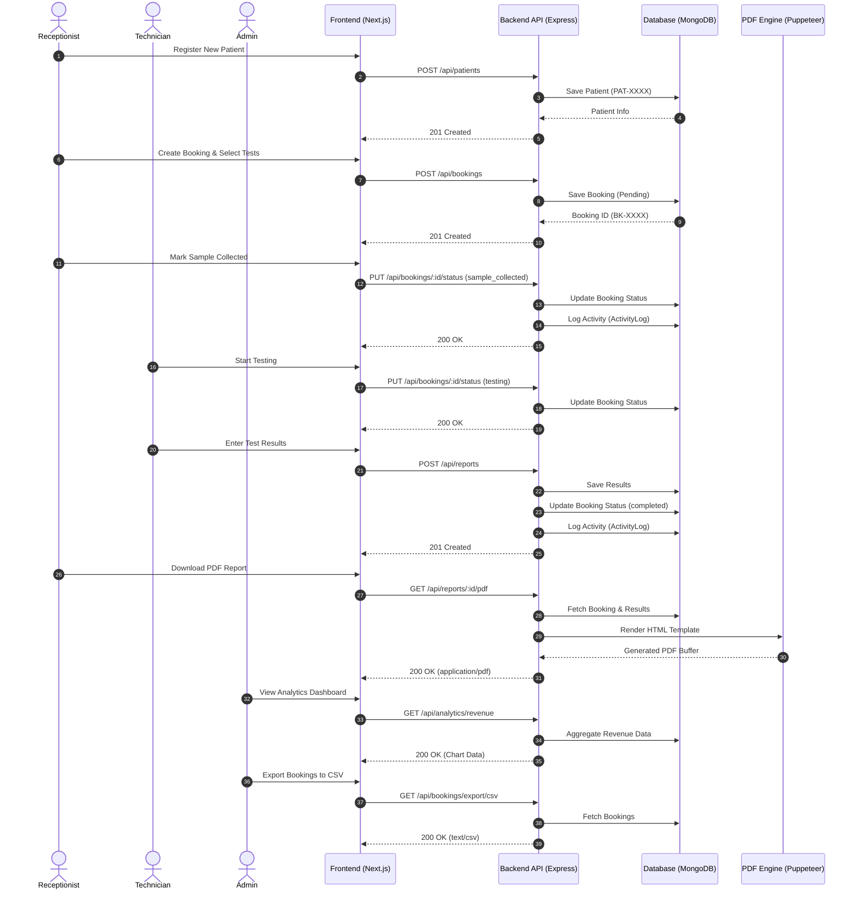

# Pathology Lab Management System - Sequence Diagram

This diagram illustrates the complete end-to-end workflow of the Pathology Lab Management System, showing the interactions between different roles (Receptionist, Technician, Admin) and the system components (Frontend, Backend API, Database, and PDF Engine).

