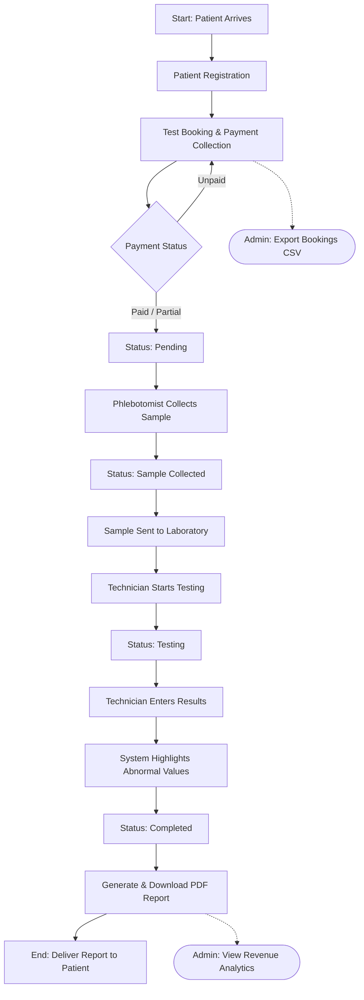

# Pathology Lab Management System - Workflow Diagram

This diagram illustrates the step-by-step operational workflow inside the diagnostic laboratory, from the moment a patient arrives to the delivery of their final PDF report.

